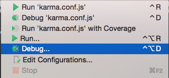
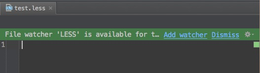
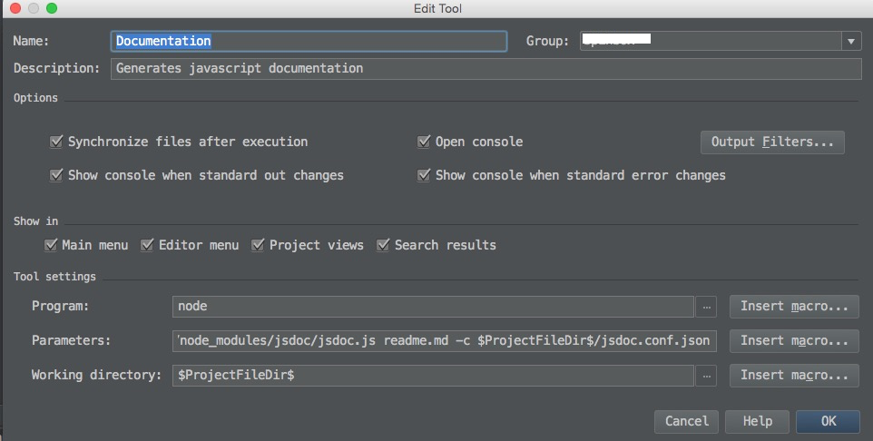
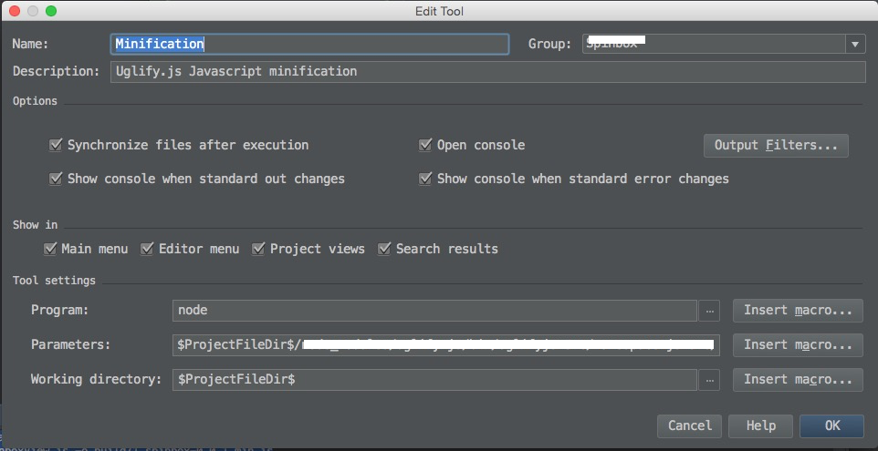
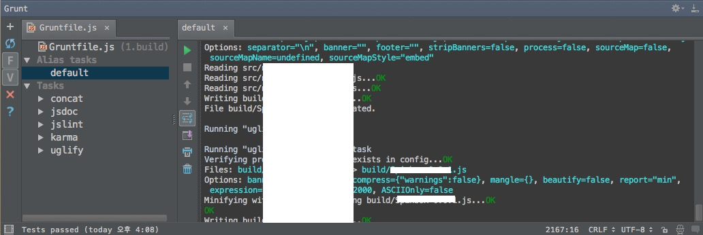

# FronEnd Development & Tools 

## Karma

http://karma-runner.github.io/0.12/index.html

2012년 구글의 소프트웨어 엔진이어로 근무하던 보이타 지나(Vojta Jina)가 AngularJS를 사용하면서 더 편리하게 테스트 할 수 이쓴 환경을 만들려고 Testacular를 개발했고 오픈 소스화 했다. Testacular는 매우 가벼우며 Node.js Socket.IO를 이용해서 자바스크립트 소스를 감시하고 수정할 때마다 자동으로 테스트를 해주고 테스트의 결과를 브라우저에 실시간으로 보여준다.

Testacular가 프로젝트명이 Karma로 바뀌면서 개발자들에게는 Karma라는 이름으로 알려졌다.

Karma는 테스트 실행환경으로 테스트 프레임워크인 Jasmine, Mocha, QUnit등의 테스트 코드를 사용 할 수 있다.

당신의 프로젝트에 Karma를 설치하기 위해서는 아래의 순서대로 따라하면 된다.
(본 프로젝트는 nodejs 및 npm을 기본으로 사용한다는 가정하에 설명하는 것입니다.)

## package.json 파일생성

프로젝트 폴더에서 `npm init`를 실행하게 되면 아래와 같이 name, version etc 등을 물어 보면 내용과 본인의 프로젝트 성격에 맞게 적어주면 package.json 파일이 생성 됩니다.

```cmd
$> npm init
```

package.json

```cmd
{
  "name": "ProjectName",
  "version": "0.0.1",
  "description": "Javascript  module",
  "main": "index.js",
  "directories": {
    "test": "test"
  },
  "scripts": {
    "test": "node_modules/karama/bin/karma start"
  },
  "author": "",
  "license": "MIT"
}
```

## 테스트 프레임워크 설치

설치되는 karma를 package.json 파일의 devDependencies 속성에 등록하기 위해서는 `--save-dev` 옵션을 적어주고 `npm install --save-dev karma` 명령어를 실행해 주시기 바랍니다.

```cmd
$> npm install --save-dev karma
$> npm install --save-dev qunit
```

pacakge.json 파일 확인

```cmd
{
  ... 생략 ...
  "scripts": {
    "test": "node_modules/karama/bin/karma start"
  },
  "author": "",
  "license": "MIT",
  "devDependencies": {
    "karma": "^0.12.28",
    "qunitjs": "^1.16.0"
  }
}
```

karma를 실행하려면 karma의 configuration 파일`karma.conf.js`을 생성해야 합니다.

아래와 같이 실행하면 몇가지 질문을 하게 되는 데 아래의 요약을 참고하세요.

```cmd
$> $ProjectFolder/node_modules/karma/bin/karma init
```

```cmd
MacPro:1.spinbox kaha$ ./node_modules/karma/bin/karma init

Which testing framework do you want to use ?
Press tab to list possible options. Enter to move to the next question.
> qunit ['jasmine, mocha, qunit etc']

Do you want to use Require.js ?
This will add Require.js plugin.
Press tab to list possible options. Enter to move to the next question.
> no

Do you want to capture any browsers automatically ?
Press tab to list possible options. Enter empty string to move to the next question.
> Chrome
> Safari
> 

What is the location of your source and test files ?
You can use glob patterns, eg. "js/*.js" or "test/**/*Spec.js".
Enter empty string to move to the next question.
> bower_components/jquery/dist/jquery.min.js
> test/**/*.js
> src/**/*.js
> 

Should any of the files included by the previous patterns be excluded ?
You can use glob patterns, eg. "**/*.swp".
Enter empty string to move to the next question.
> 

Do you want Karma to watch all the files and run the tests on change ?
Press tab to list possible options.
> no


Config file generated at "$Project/karma.conf.js".

pacakge.json 파일 확인

```cmd
{
  ... 생략 ...
  "scripts": {
    "test": "node_modules/karama/bin/karma start"
  },
  "author": "",
  "license": "MIT",
  "devDependencies": {
    "karma": "^0.12.28",
    "karma-chrome-launcher": "^0.1.7",
    "karma-firefox-launcher": "^0.1.3",
    "karma-safari-launcher": "^0.1.1",
    "karma-qunit": "^0.1.4",
	"qunitjs": "^1.16.0"
  }
}
```

## 테스트 코드작성

링크를 통해 해당사이트에서 사용법을 참조하고, 자신이 좋아하는 테스트 프레임워크의 테스트 코드를  test 폴더 밑에 작성해 주면됩니다.

* [jasmine](http://jasmine.github.io/) : BDD 지원 테스트 프레임워크
* [mocha](http://mochajs.org/)  : TDD and BDD 지원 테스트 프레임워크
* [QUnit](http://qunitjs.com/)  : JQuery개발자로 알려진 존레시(John Resig)와 존 제프러(Jorn Zaefferer)가 JQuery를 테스트 하기 위해 만든 테스트 프레임워크

## UI 테스트

UI 테스트를 하기 위해서는 `karma-html2js-preprocessor` 모듈을 사용해 HTML 파일이 로드 되도록 테스트 코드를 작성합니다.

```cmd
$> npm install --save-dev karma-html2js-preprocessor
```

## Coverage 커버리지

테스트 할 때 제품 코드를 테스트 코드로 얼마나 커버하고 있는지 즉, 얼마나 테스트로 검증하고 있는지를 수치로 나타낸 것을 말합니다.

```cmd
$> npm install --save-dev karma-coverage
```

## karma.conf.js & package.json

위의 모든 내용을 적용한  karma.config.js 파일과 package.json 파일입니다.

karma.config.js

```javascript
module.exports = function(config) {
  config.set({

    // base path that will be used to resolve all patterns (eg. files, exclude)
    basePath: '',
    
    // frameworks to use
    // available frameworks: https://npmjs.org/browse/keyword/karma-adapter
    frameworks: ['qunit'],

    // list of files / patterns to load in the browser
    files: [
      'bower_components/jquery/dist/jquery.min.js',
      'test/**/*.html',
      'test/**/*.js',
      'src/**/*.js'
    ],

    // list of files to exclude
    exclude: [
    ],

    // preprocess matching files before serving them to the browser
    // available preprocessors: https://npmjs.org/browse/keyword/karma-preprocessor
    preprocessors: {
      'test/**/*.html':['html2js'],
      'src/**/*.js':['coverage']
    },

    // test results reporter to use
    // possible values: 'dots', 'progress'
    // available reporters: https://npmjs.org/browse/keyword/karma-reporter
    reporters: ['progress','coverage'],

    // web server port
    port: 9876,

    // enable / disable colors in the output (reporters and logs)
    colors: true,

    // level of logging
    // possible values: config.LOG_DISABLE || config.LOG_ERROR || config.LOG_WARN || config.LOG_INFO || config.LOG_DEBUG
    logLevel: config.LOG_INFO,

    // enable / disable watching file and executing tests whenever any file changes
    autoWatch: false,

    // start these browsers
    // available browser launchers: https://npmjs.org/browse/keyword/karma-launcher
    // browsers: ['Chrome', 'Safari'],
    browsers: ['Chrome'],

    // Continuous Integration mode
    // if true, Karma captures browsers, runs the tests and exits
    singleRun: false
  });
};

```

package.json

```json
{
  "name": "ProjectName",
  "version": "0.0.1",
  "description": "Javascript  module",
  "main": "index.js",
  "directories": {
    "test": "test"
  },
  "scripts": {
    "test": "node_modules/karama/bin/karma start"
  },
  "author": "",
  "license": "MIT",
  "devDependencies": {
    "karma": "^0.12.28",
    "karma-chrome-launcher": "^0.1.7",
    "karma-coverage": "^0.2.7",
    "karma-firefox-launcher": "^0.1.3",
    "karma-html2js-preprocessor": "^0.1.0",
    "karma-qunit": "^0.1.4",
    "karma-safari-launcher": "^0.1.1",
    "qunitjs": "^1.16.0"
  }
}
```

##  webstorm에 적용하기

Run > Edit Configurations... > '+' 클릭 > karma 선택


### webstorm Run Test & Run Test Coverage

Run ... & Run 'karma.config.js' with Converage 를 클릭해서 테스트 및 테스트 커버리지를 실행한다.



## LESS

http://lesscss.org/http://lesscss.org/

최근 대규모 웹 페이지를 구현하는 SPA(single page application) 처럼 복잡한 웹 애플리케이션을 개발해야 하는 경우가 많ㄷ은 데 이런 CSS의 단점은 개발 생산성을 저하시키는 요인이된다. Less는 CSS의 단점을 극복하고자 개발된 CSS메타 언어(CSS 전처리) 이다.

CSS에 없는 [변수](http://eclipse.or.kr/wiki/Less_CSS#.EB.B3.80.EC.88.980), [믹스인(Mixins)](http://eclipse.or.kr/wiki/Less_CSS#.EB.AF.B9.EC.8A.A4.EC.9D.B8), [연산자&함수](http://eclipse.or.kr/wiki/Less_CSS#.ED.95.A8.EC.88.98.EC.99.80_.EC.97.B0.EC.82.B0.EC.9E.90) 등의 기능을 제공, Less를 이용해 코드 중복을 제거하고 재사용성과 스타일 정의의 효율성을 극대화 할 수있으며, 규칙을 이해하는데 시간이 적게소요된다. Less의 대표적인 사례로 [트위터의 부트스트랩 프로젝트](http://getbootstrap.com/)를 들수 있다. 또한  "Less is more"(적을수록 풍부하다) 라는 Less 만의 철학을 가지고 있다.

### 설치방법

```cmd
$> npm install --save-dev less
```

## Emmet

http://docs.emmet.io/

Emmet는 편집기에서 HTML과 CSS를 빠르게 편집할 수 있도록 도와주는 도구이다. 젠코딩(Zen-coding)이라는 프로젝트명으로 시작했다가 Emmet 이라는 이름으로 프로젝트명을 바뀌었다.

Emmet 지원 Tools WebStorm, Sulime Text, Apptina Studio, Eclipse etc

### WebStorm file watchers

File watchers
Less, CoffeeScript, TypeScript등의 컴파일해야 하는 파일을 감시하고 파일이 변경될 때 자동으로 지정된 컴파잉ㄹ을 실행하는 기능 제공

Edit 창에서 Add Watcher



Prefernences > File Watchers

Program setting값에 node_modules의 less 값을 설정한다.


### Webstorm Emmet plugin

Preferences > Emmet

*Expand abbreviation with 값을 Enter로 설정* 하게 되면  Editor 창에서 Emmet으로 HTML 문서코딩 작성시 타이핑의 수를 줄일수 있다.

코딩작성 (Enter before)

```html
<div>
  p[class=title]{Hello World}
</div>
```

코딩작성 (Enter after)

```html
<div>
  <p class="title">Hello World</p>
</div>
```

## Bower

http://bower.io/

FrontEnd Package manager로 node.js의 npm에서 영향을 받아 구현 되었습니다. 의존성 모듈을 npm의 package.json 처럼 bower는  
bower.json 에 명시해서 사용합니다.

### 설치방법

```cmd
$> sudo npm install -g bower
```

### 실행

```cmd
$bower init
```

bower.json
```json
{
  "name": "ProjectName",
  "version": "0.0.1",
  "license": "MIT",
  "ignore": [
    "**/.*",
    "node_modules",
    "bower_components",
    "test"
  ],
  "dependencies": {
    "jquery": "~2.1.1"
  }
}

```

### WebStorm Bower

Preferences > Bower


## JSDoc3 Annotation

Annotation은 메타정보나 객체간의 관게 정보 같이 특수한 의미를 부여하기 위해 작성한 주석입니다.

JSDoc3 Annotation은 @type Tag, @extends tag 등의 자바스크립트에 부족한 표현을 채워 줍니다.

자바스크립트를 문서화하는 도구는 JSDoc3 외에도 YUIDoc, Docco, JSDog etc 여러가지가 있지만  JSDoc 계열이 가장 널리 사용되고 있다.

사이트 : https://github.com/jsdoc3/jsdoc
Documention : http://usejsdoc.org/

### 설치방법

```cmd
$> npm install --save-dev jsdoc
```

### Webstorm External Tools

Prefenences > External Tools 에서 "+" 추가버튼을 클릭한다.

Name : Documentation, Group : GroupName, Description : 상세설명, Options :  모두체크, Program : node, Working directory : $ProjectFileDir$

Parameters :
```cmd
$ProjectFileDir$/node_modules/jsdoc/jsdoc.js readme.md -c $ProjectFileDir$/jsdoc.conf.json
```

jsdoc.conf.json의 Configuration설정에 대한 자세한 사용법 : http://usejsdoc.org/about-configuring-jsdoc.html

```json
{
  "tags": {
    "allowUnknownTags": true
  },
  "source": {
    "include":["./src"],
    "exclude":["./src/Model"],
    "includePattern": ".+\\.js(doc)?$",
    "excludePattern": "(^|\\/|\\\\)_"
  },
  "plugins": [],
  "templates": {
    "cleverLinks": false,
    "monospaceLinks": false
  },
  "opts": {
    "encoding":"utf8",
    "destination":"docs",
    "recurse":true,
    "private":true
  }
}
```


### 사용법

Menu Tools > GroupName > Minification 실행한다.

### Theme(테마)

JSDoc3 기본 스킨에 JSDoc3 Theme 중  가장유명한 [Docstrap](https://github.com/terryweiss/docstrap) 적용해 보겠습니다.

```cmd
$> sudo npm install --save-dev ink-docstrap
```

JSDoc의 Extend Tools의 parameters 설정에 `-t $ProjectFileDir$/node_modules/ink-docstrap/template`를 추가한다.

또한 jsdoc.conf.json 파일을 아래와 같이 수정한다.

```json
{
  "tags": {
    "allowUnknownTags": true
  },
  "source": {
    "include":["./src"],
    "exclude":["./src/Model"],
    "includePattern": ".+\\.js(doc)?$",
    "excludePattern": "(^|\\/|\\\\)_"
  },
  "plugins": [],
  "templates": {
    "systemName":"자바스크립트 모듈",
    "footer":"",
    "copyright":"copyright(c) 2014 MIT license",
    "theme": "cerulean",
    "navType": "vertical",
    "linenums":true,
    "collapseSymbols":false,
    "inverseNav":false,
    "outputSourceFiles":true,
    "cleverLinks":false,
    "monospaceLinks":false
  },
  "opts": {
    "encoding":"utf8",
    "destination":"docs",
    "recurse":true,
    "private":true
  }
}
```
## Uglify.js

Uglify.js는 자바스크립트 압축, 난독화 라이브러리이며, 웹에서도 이용할수 있습니다.

### 설치방법

```cmd
$> npm install --save-dev uglify-js
```

### WebStorm External Tools

External Tools을 이용한 자바스크립트 압축

Prefenences > External Tools 에서 "+" 추가버튼을 클릭한다.

Name : Minification, Group : GroupName, Description : 상세설명, Options :  모두체크, Program : node, Working directory : $ProjectFileDir$

Parameters :
```cmd
$ProjectFileDir$/node_modules/uglify-js/bin/uglifyjs src/namespace.js src/model.js src/view.js -o build/projectname-0.0.1.min.js
```



### 사용법

Menu Tools > GroupName > Minification 실행한다.


## grunt-init

프로젝트 디렉터리 구조를 자동으로 생성, 단위 테스트의 샘플코드를 자동으로 생성 해주는 기반 구조나 재료를 스캐폴딩 하는데 사용되는 툴입니다.

스캐폴딩 (skafolding)

> 건축물에서 유래한 이용어는 발판, 재료, 가설물등의 사전적인 의미를 가지고 있습니다. 한국에서는 비계라고 불리며 건물을 지을때 높은 곳에서도 원활히 일할 수 있도록 다리처럼 설치하는 임시 가설물을 가리킨디ㅏ. 소프트웨어 공학에서는 개발을 쉽게 할 수 있도록 도와주는 일련의 자동화 과정을 가리키는 데 사용합니다.


### 설치방법
```cmd
$> sudo npm install -g grunt-cli
$> sudo npm install -g grunt-init
```

CommonJs 표준을 준수하는 모듈 프로젝트를 가정하에 아래와 같이 진행하면 된다.

```cmd
1) 다운받은 grunt-init-commonjs 파일을 ~/.grunt-init/commonjs에 설치
$> git clone https://github.com/gruntjs/grunt-init-commonjs.git ~/.grunt-init/commonjs

2) WebStorm을 통해서 Empty Project를 생성

3) Project에 commonjs 기본 프로젝트 구조 생성 (이후 물어보는데로 작성)
$> grunt-init commonjs

```

## grunt 

grunt 태스크 자동화 도구를 사용하면 프로젝트 생성부터 빌드, 배포까지 대부분의 작업을 자동화 시킬 수 있다.

JSDoc 와 Uglify.js 는 Grunt로 자동화 되므로 Grunt 사용시 설치 할 필요가 없다.

```cmd
$> npm uninstall --save-dev uglify-js
$> npm uninstall --save-dev jsdoc
```

Grunt 를 이용해 JSLint, karma, Jsdoc, concat, Uglify 5가지 기능을 제공 받기 위해서는 아래와 같이 모듈을 설치해 줍니다.

```cmd
$> sudo npm install --save-dev grunt
$> sudo npm install --save-dev grunt-jslint  -> 품질검증 태스크
$> sudo npm install --save-dev grunt-karma -> 테스트 자동화 태스크
$> sudo npm install --save-dev grunt-jsdoc -> 문서화 태스크
$> sudo npm install --save-dev grunt-contrib-concat -> 파일 합치기 태스크
$> sudo npm install --save-dev grunt-contrib-uglify -> 파일 압축 태스크
```


Gruntfile.js 에 위의 설정내용을 통합하면 아래와 같습니다. 테스트 자동화를 위한 카르마 태스크 설정시 karma.conf.json 의 autoWatch는  파일이 수정 될 때마다 테스트를 자동화 시켜주며, singleRun은 테스트를 한번만 실행하는 옵션입니다.

Grunfile.js

```javascript

module.exports = function(grunt) {
  'use strict';

  // 태스크 공급자를 통한 Plugin 로딩
  grunt.loadNpmTasks('grunt-jslint');
  grunt.loadNpmTasks('grunt-karma');
  grunt.loadNpmTasks('grunt-jsdoc');
  grunt.loadNpmTasks('grunt-contrib-concat');
  grunt.loadNpmTasks('grunt-contrib-uglify');

  // 프로젝트 설정
  grunt.initConfig({
    pkg : grunt.file.readJSON('package.json'),
    jslint : {
      spinbox: {
        src : ['src/**/*.js'],
        exclude: [],
        directives: {
          nomen : true,
          white : true,
          browser : true,
          sloppy : true,
          predef : [
            'naver', '$'
          ]
        }
      }
    },
    karma: {
      unit: {
        configFile: 'karma.conf.js'
      }
    },
    jsdoc: {
      dist: {
        src:['readme.md'],
        options: {
          'template':'node_modules/ink-docstrap/template',
          'encoding':'utf-8',
          'destination':'docs',
          'recurse':true,
          'private':true,
          'configure':'jsdoc.conf.json'
        }
      }
    },
    concat: {
      dist: {
        src: ['src/**/*.js'],
        dest:'build/<%= pkg.name %>-<%= pkg.version %>.js'
      }
    },
    uglify: {
      dist: {
        files: {
          'build/<%= pkg.name %>-<%= pkg.version %>.js':'build/<%= pkg.name %>-<%= pkg.version %>.js'
        }
      }
    }
  });

  //기본 태스크
  grunt.registerTask('default',['jslint', 'karma', 'jsdoc', 'concat', 'uglify']);

};

```

### WebStorm 에서 Grunt 활용

Tools > Open Grunt Console 을 클릭합니다.



