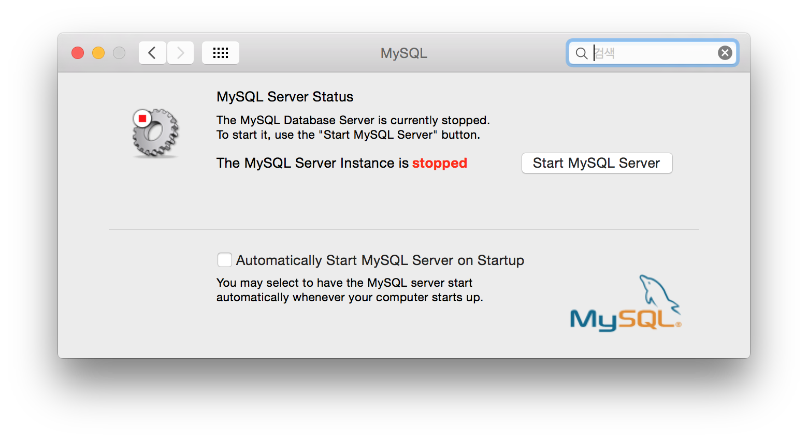

# Mysql 설치

Yosemite 버전 (10.10) 에서는  최신버전인 `Mac OS X ver.10.9(x86, 65-bit), DMG Archive` 가 정상적으로 설치가 되지 않는다. 해당 문제를 해결하기 위해서는 아래와 같은 절차로 설치 해야 합니다.

그리고 우선 [Mysql](http://dev.mysql.com/downloads/mysql/) 다운로드 해야 합니다.

1) 설치 시 `사용자화` 인스톨를 통해서 `Startup Item`를 Skip 시킨 상태에서 설치한다. *유의) 기본설치를 하는 경우에는 설치시 설치오류 발생하게 됩니다.*


2) .bash_profile 에 아래의 구문을 추가등록 합니다.

```cmd
# MySql 5.6.21
export PATH="/usr/local/mysql/bin:$PATH"
```
3) Mysql를 수동으로 실행합니다.

> System Preferences ( 시스템 환경설정 ) 에서 Mysql를 실행 하고 아래의 Start MySql Server를 클릭
>
> Terminal 창에서 아래와 같이 실행

```cmd
$> sudo /usr/local/mysql/support-files/mysql.server start
or
$> sudo mysql.server start
```

4) OS부팅시 자동으로 Mysql를 실행하기 위해서는 아래의 참고를 보시고 추가설정 해주시면 됩니다.

5) Mac의 Mysql Server는 WorkStation이 존재하지 않기 때문에 본이지 자주 사용하는  MySql Client Utility를  다운받아 사용하시기 바랍니다. 나의 경우에는 [Toad Mac Edition](https://itunes.apple.com/us/app/toad/id747961939?ls=1&mt=12&ac=ToadMacEdition)를 AppStore에서 다운받아 사용하고 있습니다.

* 참고

> http://coolestguidesontheplanet.com/get-apache-mysql-php-phpmyadmin-working-osx-10-10-yosemite/

### MySql 재시작
```cmd
$> sudo /usr/local/mysql/support-files/mysql.server restart
```

## MySQL 기본 캐릭터셋 설정

일단 /etc/my.cnf 파일이 있는지 확인하고 없으면 /usr/local/mysql/support-files 폴더에서 my-default.cnf 파일을 복사해온다.

```cmd
$> cp /usr/local/mysql/support-files/my-default.cnf /etc/my.cnf
```

/etc/my.cnf에 아래의 내용을 추가한다.

```txt
[mysqld]
character-set-server=utf8
collation-server=utf8_general_ci

init_connect=SET collation_connection=utf8_general_ci
init_connect=SET NAMES utf8

[client]
default-character-set=utf8

[mysql]
default-character-set=utf8
```

## MySql 삭제

MySql을 Mac에 설치하게 되면 밑과 같이 시스템환경에 설정화면이 등록됩니다. 서비스 시작 및 자동여부를 결정할 수 있는 기능 설정화면을 제공하는데 MySql서버만 지워주는게 아니라 이러한 설정화면도 지워줘야 하는데 MySql 서버와 설정화면을 제거하기 위해서는 아래의 명령어을 콘솔창으로 실행해(제거) 주면 됩니다.



```cmd

sudo rm /usr/local/mysql
sudo rm -rf /usr/local/mysql*
sudo rm -rf /Library/StartupItems/MySQLCOM
sudo rm -rf /Library/PreferencePanes/My*
rm -rf ~/Library/PreferencePanes/My*
sudo rm -rf /Library/Receipts/mysql*
sudo rm -rf /Library/Receipts/MySQL*
sudo rm -rf /var/db/receipts/com.mysql.*
 
```
