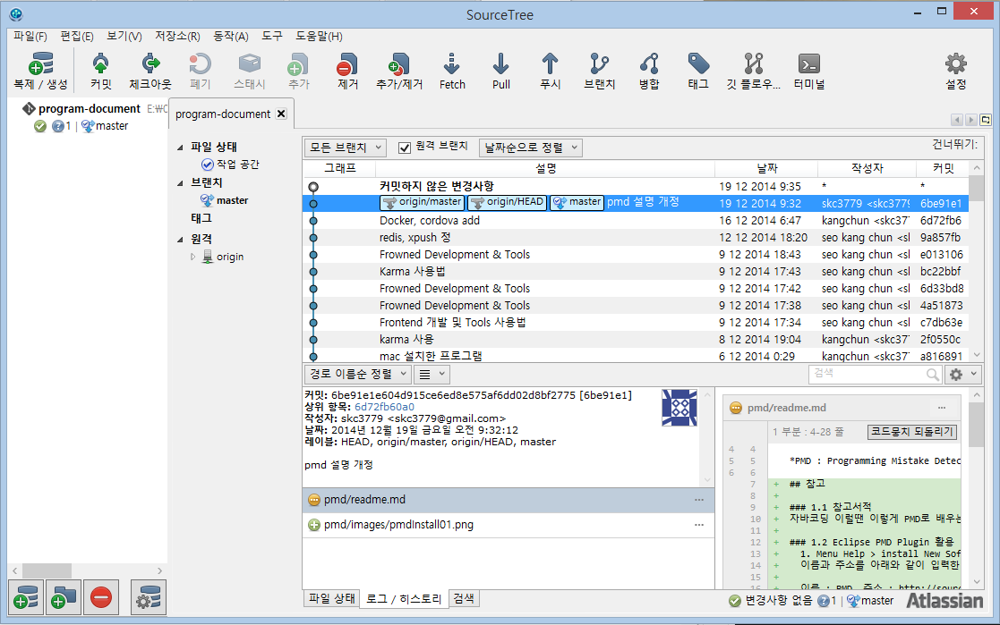
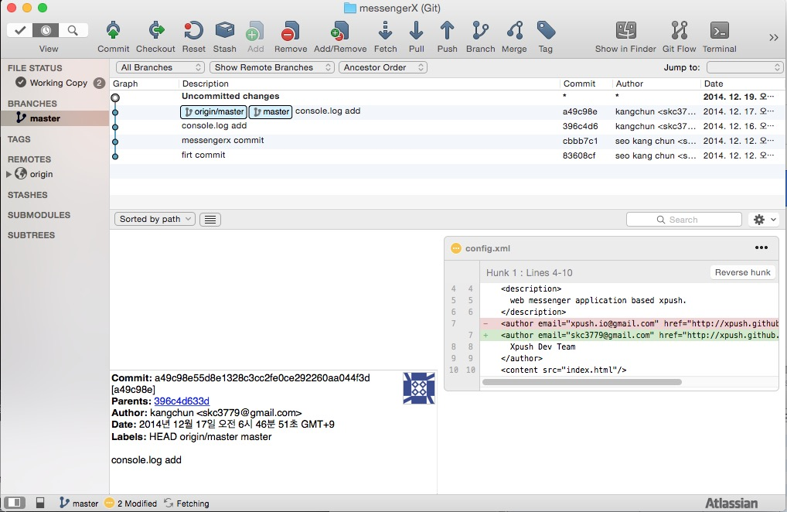

# SourceTree

사이트 : http://sourcetreeapp.com/

QNA : http://sourcetreeapp.com/faq/

Atlassian의 소스트리앱 git을 GUI Tools로 관리 할 수 있도록 해주는 편리한 애플리케이션이다.

Github, Bitbucket, Stash, Bamboo 등의 Git Products을 지원하고 있으며, OS로는 Mac, Linux, Window 등에 설치가 가능하다.

### 윈도우(Windows8) 설치화면

### 맥(Mac OS X Yosemite) 설치화면

