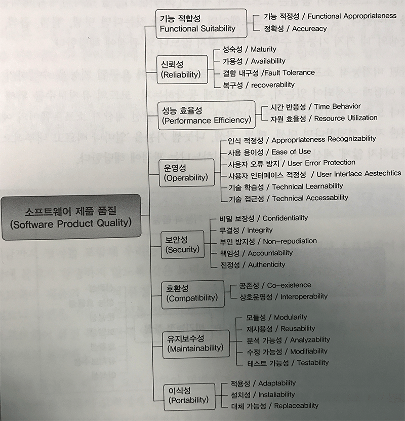

# 코드 품질 시각화의 정석

저자 김모세 지음

### 소프트웨어 품질 모델

소프트웨어 품질 모델에 따르면 기능적인 품질의 특성인 기능 적합성을 제외한 비기능적 품질 특성의 수가 월등이 많다.

## 소나큐브

#### 코드 품질을 관리하는 일곱가지 요소

* 아키텍처와 설계 (Architecture & Design)
* 코드중복 (Duplications)
* 단위 테스트 (Unit Test)
* 복잡도 (Comlexity)
* 발생 가능한 잠재적 버그 (Potential bugs)
* 코딩 규칙 (Coding rules)
* 주석 (Comments)

#### 플러그인을 통한 기능 및 비기능의 확장 가능
#### 다양한 프로그램밍 언어 분석 지원
#### 코드 품질 관리 집중화 
