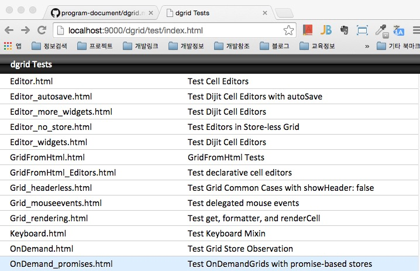

# dgrid

dgrid는 오픈소스 웹 그리드 중에서 가장 성능이 좋아 보인다. 그럼 dgrid 데모를 직접 자신의 pc설치해 보자.

site
http://dgrid.io/

example
http://dgrid.io/js/dgrid/test/

source
https://github.com/sitepen/dgrid#readme

## 소스설치

```cmd
$> git clone https://github.com/SitePen/dgrid.git

```

## bower를 이용한 설치방법

github에 있는 소스를 실행시키면 dependencies 라이브러리가 없기 때문에 test 폴더밑의 테스트 파일을 실행 시킬 수 없으니 지금 부터 나와 같이 실행시키기 위한 절차를 따라해 보도록 하자.

#### 1. 최상위 폴더를 만든다.

```cmd
$> [원하는 디렉토리]/dgrid-demo
```

#### 2. dgrid를 github에서 내려받아 설치한다.

```cmd
$dgrid-demo>git clone https://github.com/SitePen/dgrid.git
$dgrid-demo>ls -la
wxr-xr-x   36 seokangchun  staff  1224  1  9 14:13 dgrid
```

#### 3. 디펜던시  라이브러리를 설치하기 위한 bower 스크립트를 생성한다.

.bowerrc

```json
{
	"directory":"."
}
```

bower.json

```json
{
	"name": "dgrid",
 	"version": "1.0.0",
	"dependencies": {
		"dojo": ">=1.8.9",
		"dstore": "~1.0",
		"xstyle": ">=0.1.3",
		"put-selector": ">=0.3.6",
		"dijit": ">=1.9.3",
		"dojox": ">=1.9.3",
		"util": "dojo-util#>=1.9.3"
	}
}
```

#### 4. bower install 를 실행하여 디펜던시 파일을 실행한다.

bower가 설치되어 있지 않으면 [bower](https://github.com/skc3779/program-document/tree/master/bower)  클릭해서 설치방법을 참고한다.

```cmd
$dgrid-demo>bower install
$dgrid-demo>ls -la
wxr-xr-x   13 seokangchun  staff   442  1  9 14:01 .
drwxr-xr-x   19 seokangchun  staff   646  1  9 14:12 ..
-rw-r--r--@   1 seokangchun  staff  6148  1  9 14:01 .DS_Store
-rw-r--r--    1 seokangchun  staff    20  1  9 14:01 .bowerrc
-rw-r--r--    1 seokangchun  staff   728  1  9 13:54 bower.json
drwxr-xr-x   36 seokangchun  staff  1224  1  9 14:13 dgrid
drwxr-xr-x   90 seokangchun  staff  3060  1  9 14:01 dijit
drwxr-xr-x   95 seokangchun  staff  3230  1  9 14:01 dojo
drwxr-xr-x  103 seokangchun  staff  3502  1  9 14:01 dojox
drwxr-xr-x   27 seokangchun  staff   918  1  9 14:01 dstore
drwxr-xr-x   10 seokangchun  staff   340  1  9 14:01 put-selector
drwxr-xr-x   19 seokangchun  staff   646  1  9 14:01 util
drwxr-xr-x   24 seokangchun  staff   816  1  9 14:01 xstyle
```

#### 5. http server를 실행서켜 테스트를 직접 실행해 본다.

[http server](https://github.com/skc3779/program-document/tree/master/http-server) 관련해서는 이곳을 클릭해 참고한다.

python 2+ 에서의 simple http server 

```cmd
$dgrid-demo>python -m SimpleHTTPServer 9000
```

#### 6. 브라우저 실행모습

http://localhost:9000/dgrid/test/index.html

