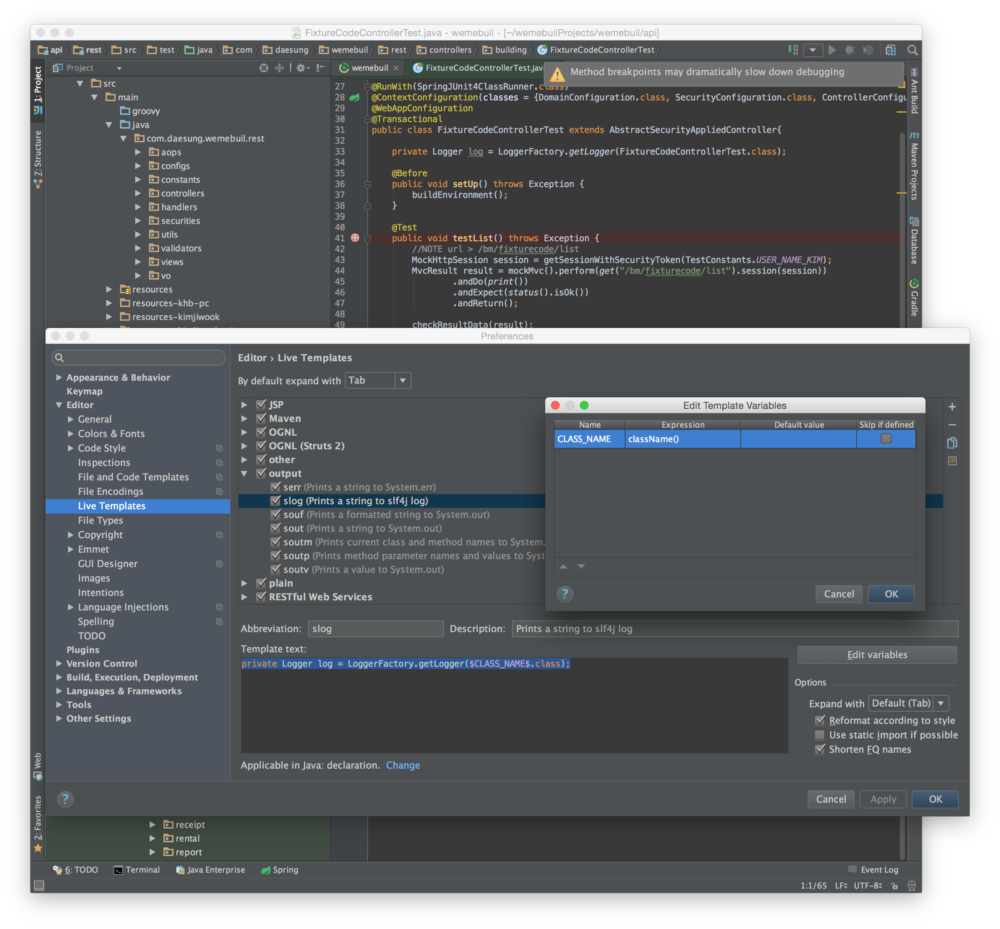

# Intellij 1.4 기능 정의

## 1. Intellij IDEA에서 파일 인코딩 설정 및 로케일 언어 출력

Preferences > File Encodeings 에서  Transparent native-to-ascii convertion 을 체크해 주면 .properties 한글을 입력하게 되면 자동으로  UTF-8  인코딩값으로 변환하여 등록하게 되며,  Editor 에서는 한글로 표시됩니다.

설정 후 Intellij 재시작이 필요합니다.


## 2. Tool Buttons 

Menu > View > Tool Buttons

Intellij의 Gradle, Maven, Commander, IDETalk, Bean Validation 등의 Tool Window을 화면의 좌측에 Bar형식으로 위치시켜주는 기능


## 3. live templates

자동으로 구문을 완성해주는 기능이 있다.

Mac 기준으로 설명, Intellij IDEA > Preference > Editor > Live Templates

원하는 그룹에 자동으로 생성하고 싶은 코드구분을 생성 해 준다.

아래는 `private Logger log = LoggerFactory.getLogger($CLASS_NAME$.class);` 구문을 자동으로 생성해주기 위한 절차이다.

1. output 그룹 선택
2. `+` 클릭해서 Abbreviation 에는 slog , Description에는  Prints to string to Slf4j를 입력하고  Template text:에 아래의 내용을 입력한다.

```java
private static final Logger log = LoggerFactory.getLogger($CLASS_NAME$.class);
```

이때 `$CLASS_NAME$`는 대체해주고자 하는 문자로  Edit variables 버튼을 눌러 Expression 메소드와 매칭을 해준다.


