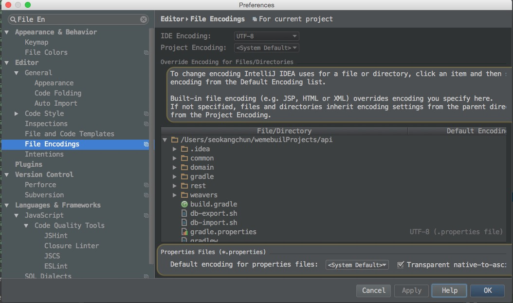
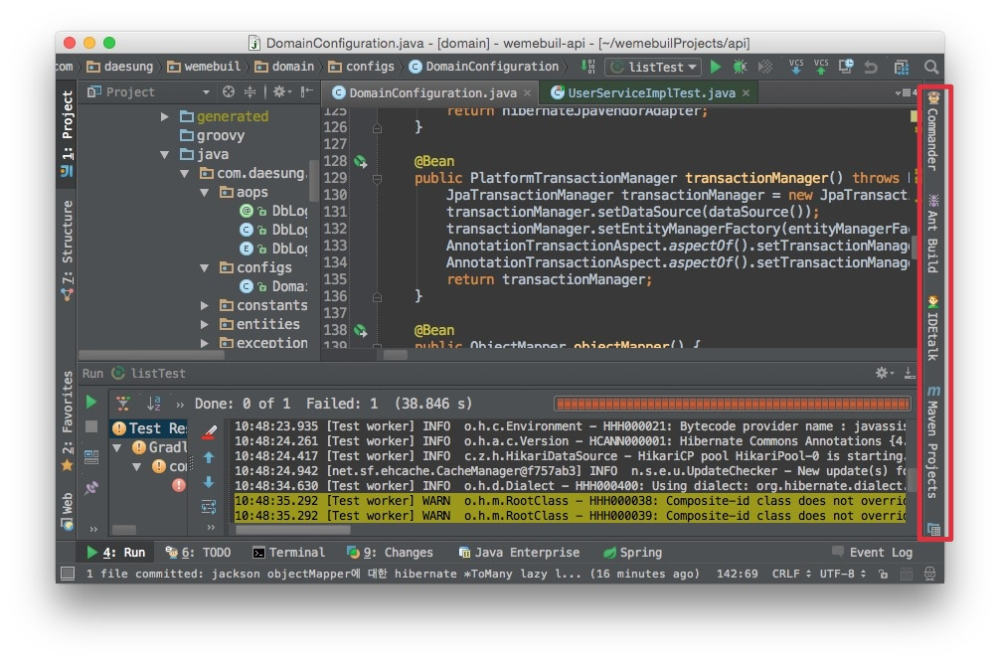

# Intellij 1.4 기능 정의

## 1. Intellij IDEA에서 파일 인코딩 설정 및 로케일 언어 출력

Preferences > File Encodeings 에서  Transparent native-to-ascii convertion 을 체크해 주면 .properties 한글을 입력하게 되면 자동으로  UTF-8  인코딩값으로 변환하여 등록하게 되며,  Editor 에서는 한글로 표시됩니다.

설정 후 Intellij 재시작이 필요합니다.

## 2. Tool Buttons 

Menu > View > Tool Buttons

Intellij의 Gradle, Maven, Commander, IDETalk, Bean Validation 등의 Tool Window을 화면의 좌측에 Bar형식으로 위치시켜주는 기능

