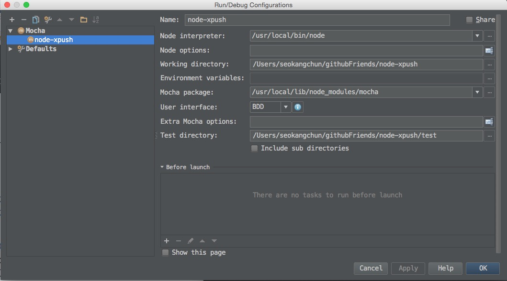

# NodeJs 사용법

### 설치방법

블로그 참고 : http://bcho.tistory.com/884

### npm install

`npm install [npm module]` 구문으로 필요한 모듈을 설치 할 수 있습니다.

### npm delete

```cmd
$> npm uninstall [@<scope>/]<package> [--save|--save-dev|--save-optional]
```
In global mode (ie, with -g or --global appended to the command), it uninstalls the current package context as a global package.

### npm find

```cmd
$> npm list | grpe -n "이름"
```

```cmd
This prints the version of npm itself:
npm -v <package-name>

This prints a cryptic error:
npm version <package-name>

This prints the package version on the registry (i.e. the latest version available):
npm view <package-name> version
```

npm list for local packages or npm list -g for globally installed package

```cmd
├─┬ cli-color@0.1.6 
│ └── es5-ext@0.7.1 
├── coffee-script@1.3.3 
├── less@1.3.0 
├─┬ sentry@0.1.2 
│ ├── file@0.2.1 
│ └── underscore@1.3.3 
└── uglify-js@1.2.6 
```

## Unit Test Tools

### Mocha
simple, flexible, fun javascript test framework for node.js & the browser 하다고 소개되어 있으며, 테스트 프레임워크에는
접근방식에 따라  TDD와 BDD로 나눌 수 있는데 expresso는 TDD 프레임워크 이고, vows는 BDD프레임워크 입니다. Mocha는 이러한
2가지 모두를 지원해주기 때문에 테스트 프레임워크가 바뀌지 않아도 개발자가 원하는 방식으로 테스트를 할 수있습니다.

BDD와 TDD차이점 설명 : http://blog.aliencube.org/ko/2014/04/02/differences-between-bdd-and-tdd/

TDD 방식
```javascript
suite('TDD Style', function() {
  suiteSetup(function() {
    // excuted before test suite 
  });
 
  suiteTeardown(function() {
    // excuted after test suite 
  });
 
  setup(function() {
    // excuted before every test 
  });
 
  teardown(function() {
    // excuted before every test 
  });
 
  suite('#example', function() {
    test('this is a test', function() {
      // write test logic
    });
  });
});
```

BDD방식
```javascript
describe('BDD style', function() {
  before(function() {
    // excuted before test suite
  });
 
  after(function() {
    // excuted after test suite
  });
 
  beforeEach(function() {
    // excuted before every test
  });
 
  afterEach(function() {
    // excuted after every test
  });
   
  describe('#example', function() {
    it('this is a test.', function() {
      // write test logic
    });
  });
});

```

### WebStorm

WebStorm에서 Mocha 테스트 방식

Run > Edit configuration..
주요설정  Node interpreter, Working Ddirectory, Mocha packages, Test directory를 설정해 주며


## 참고링크

io.js
https://gist.github.com/maxogden