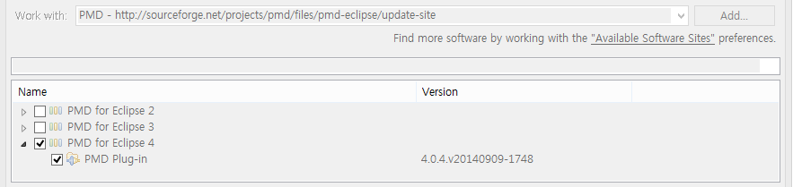

# PMD

자동소스분석도구인 PMD의 역할은 귀찮은 프로그래밍의 제약사항이 아닌 올바른 프로그래밍을 위한 가이드라인을 제공한다. 프로그래밍은 규칙이 매우 복잡하고 다양해서 실수가 빈번히 발생하게 된다 이에 정적분석도구인 PMD를 활용 하게 되면 자주 발생하는 문제점을 분석하고 권고해서 비슷한 실수를 범하는 것을 방지 할 수 있다.

*PMD : Programming Mistake Detector*

## 참고

### 1.1 참고서적
자바코딩 이럴땐 이렇게 PMD로 배우는 올바른 자바코딩 방법 [소스코드](https://github.com/wikibook/java-coding-with-pmd)

### 1.2 Eclipse PMD Plugin 활용
  1. Menu Help > install New Software > Add Repository 창에서 PMD 다운로드를 위한
  이름과 주소를 아래와 같이 입력한다.
  
  이름 : PMD, 주소 : http://sourceforge.net/projects/pmd/files/pmd-eclipse/update-site
  2. 그리드 항목에 elipse 2, 3, 4 버전의 애플리케이션 중 자신에 맞는 elipse pmd 체크항목을 선택 후 다운로드 받아 설치한다.
  
  

## 프로그래밍 일반 규칙

## 가독성과 명명규칙

#### 3.1 패키지 명명규칙

* 패키지명은 ASCII 코드에 포함된 소문자로 구성한다.
* 패키지명은 패키지의 기능을 정확히 전달 할 수 있는 단어의 명사를 사용해야 한다.
* 패키지의 최상위 부분은 소문자의 도메인명이어야 한다.
* 하위 컴포넌트명은 내부 명명 규칙을 따를 수 있다.
* 달러기호($) 패키지명으로 사용하지 않는다.

#### 3.2 클래스 및 인터페이스 명명규칙

* 클래스명은 파스칼 표기법을 바탕으로 명명해야 한다.
* 클래스명에는 명사만 사용할 수있다.
* 명사를 사용할 때 너무 긴 경우 축약해서 사용할 수 있는만 의미가 불분명한 너무 짧은 이름은 자제한다.
* 클래스명 내의 축약단어는 모두 대분자로 표현한다.
* 5글자 이하의 클래스명은 쓰지 않는다.
* 클래스명에는 밑줄을 사용할 수 없다.
* 클래스명에 달러기호($)를 사용하지 않는다.

#### 3.3 메서드 명명규칙

* 메서드명은 카멜 표기법을 바탕으로 지어야 한다.
* 메서드명에는 동사 또는 동사와 명사의 조합을 사용할 수 있다.
* 명사를 사용할 때 너무 긴 경우 축약해서 사용 할 수 있지만 의미가 불분명한 너무 짧은 이름은 자제한다.
* 메서드명 내의 축약어는 모두 대분자로 표현한다.
* 의미가 불분명한 세 글자 이하의 메서드명은 ㅆ즈 않는다.
* 메서드명에는 밑줄을 사용할 수 없다.
* 메서드명에는 달러 기호($)를 사용 할 수 없다.

#### 3.4 추상 클래스의 명명 규칙

* 추상 클래스명은 파스칼 표기법을 토대로 짓는다.
* 추상 클래스명에는 명사만 사용할 수 있다.
* 명사를 사용할 때 너무 긴 경우 축약해서 사용할 수 있지만 의미가 불분명한 너무 짧은 이름은 자제한다.
* 추상 클래스명 내의 축약어는 모두 대분자로 표현한다.
* 5글자 이하의 추상 클래스명은 쓰지 않는다.
* 클래스명에 밑줄은 사용 할 수 없다.
* 달러 기호($)를 추상화 클래스명에 사용하지 않는다.
* 추상 클래스명에는 접두사로 Abstract를 포함한다.

#### 2.5 변수 명명 규칙

* 변수명은 카멜 표기법을 바탕으로 지어야 한다.
* 변수명은 내의 축약어는 모두 대문자로 표현한다.
* 반복문의 증감변수 등 임시 변수가 아니면 의미가 불분명한 세글자 의하의 변수명은 쓰지 않는다.
* 너무 긴 변수명은 사용하지 않는다.
* 변수명에는 밑줄을 사용할 수 없다.
* 변수명에는 달러 기호($)를 사용 할 수 없다.
* 공통 사전을 만들어 변수명에 사용되는 공통적인 단어를 정의한다.

## 괄호 규칙

## 올바른 문자열 처리

## 올바른 주석 사용법

## 패키지 참조방법

## 빈 코드사용법

