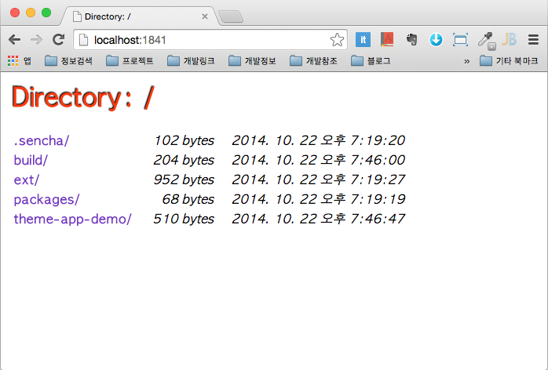

## Sencha Cmd 사용법

### 1. Sencha SDK로 프로젝트 생성하기

```cmd
Sencha -sdk [ ExtJs SDK 경로명 ] generate app  extjs4 [ 생성할 APP 경로명 ]
```

```cmd
$ sencha -sdk ~/WorkSpace/SenchaStudy/ext-4.2.1/ generate app extjs4 ~/WorkSpace/extjs4

$ls -la
total 176
drwxr-xr-x  20 seokangchun  staff    680 10 22 17:36 .
drwxr-xr-x  12 seokangchun  staff    408 10 22 19:14 ..
drwxr-xr-x   4 seokangchun  staff    136 10 22 15:13 .sencha
-rw-r--r--   1 seokangchun  staff   1283 10 22 15:13 Readme.md
drwxr-xr-x   8 seokangchun  staff    272 10 22 15:29 app
-rw-r--r--   1 seokangchun  staff    607 10 22 16:48 app.js
-rw-r--r--   1 seokangchun  staff    104 10 22 15:13 app.json
-rw-r--r--   1 seokangchun  staff    303 10 22 17:36 bootstrap.css
-rw-r--r--   1 seokangchun  staff  50873 10 22 17:36 bootstrap.js
-rw-r--r--   1 seokangchun  staff    282 10 22 17:36 bootstrap.json
drwxr-xr-x   5 seokangchun  staff    170 10 22 17:36 build
-rw-r--r--   1 seokangchun  staff   1469 10 22 15:13 build.xml
drwxr-xr-x  28 seokangchun  staff    952 10 22 15:13 ext
-rw-r--r--   1 seokangchun  staff    484 10 22 15:13 index.html
drwxr-xr-x   2 seokangchun  staff     68 10 22 15:13 overrides
drwxr-xr-x   2 seokangchun  staff     68 10 22 15:13 packages
drwxr-xr-x   3 seokangchun  staff    102 10 22 17:25 resources
drwxr-xr-x   7 seokangchun  staff    238 10 22 17:30 sass
```

### 2. Sencha Workspace 설치하기

**generate workspace** 를 하게되면 ExtJs 프로젝트를 관리하기위한 기본 작업공간이 만들어 진다.
아래와 같이 Sencha Cmd가 설치되어 있는 상태에서 아래의 커맨드 라인을 입력하여 워크스페이스를  생성한다.

```cmd
sencha --sdk-path <EXTJS5_APTH> generate workspace -ext my-workspace
```

위 커맨드를 실행하면 my-workspace라는 작업공간이 생성되는데 생성이 완료되면 ext 디렉토리에 ExtJS 4.2.1 or 5가 위치하게 되고
ext, packages 디렉토리가 생성됨

```cmd
$ sencha --sdk-path ~/sencha/Sdk/ext-4.2.1.883 generate workspace -ext my-workspace
$ cd my-worksapce
$ ls -la
total 0
drwxr-xr-x   5 seokangchun  staff  170 10 22 19:19 .
drwxr-xr-x   3 seokangchun  staff  102 10 22 19:19 ..
drwxr-xr-x   3 seokangchun  staff  102 10 22 19:19 .sencha
drwxr-xr-x  28 seokangchun  staff  952 10 22 19:19 ext       (ExtJS SDK)
drwxr-xr-x   2 seokangchun  staff   68 10 22 19:19 packages  (ExtJs Locale & Theme)
```

###  3.  Workspace내 Sencha Application을 설치하기

위에서 생성한 my-workspace내에 theme-app-demo 애플리케이션을 아래와 같이 설치 한다.

```cmd
$ pwd
/Users/seokangchun/sencha/Workspace/test/my-workspace
$ sencha -sdk ext  generate app themeAppDemo theme-app-demo

$ ls -la
drwxr-xr-x   7 seokangchun  staff  238 10 22 19:35 .
drwxr-xr-x   3 seokangchun  staff  102 10 22 19:19 ..
drwxr-xr-x   3 seokangchun  staff  102 10 22 19:19 .sencha
drwxr-xr-x   3 seokangchun  staff  102 10 22 19:35 build
drwxr-xr-x  28 seokangchun  staff  952 10 22 19:19 ext
drwxr-xr-x   2 seokangchun  staff   68 10 22 19:19 packages
drwxr-xr-x  15 seokangchun  staff  510 10 22 19:35 theme-app-demo

$ cd theme-app-demo
$ ls -la
drwxr-xr-x  15 seokangchun  staff    510 10 22 19:35 .
drwxr-xr-x   7 seokangchun  staff    238 10 22 19:35 ..
drwxr-xr-x   3 seokangchun  staff    102 10 22 19:35 .sencha
-rw-r--r--   1 seokangchun  staff   1313 10 22 19:35 Readme.md
drwxr-xr-x   8 seokangchun  staff    272 10 22 19:35 app
-rw-r--r--   1 seokangchun  staff    316 10 22 19:35 app.js
-rw-r--r--   1 seokangchun  staff    107 10 22 19:35 app.json
-rw-r--r--   1 seokangchun  staff    294 10 22 19:35 bootstrap.css
-rw-r--r--   1 seokangchun  staff  50782 10 22 19:35 bootstrap.js
-rw-r--r--   1 seokangchun  staff    282 10 22 19:35 bootstrap.json
-rw-r--r--   1 seokangchun  staff   1472 10 22 19:35 build.xml
-rw-r--r--   1 seokangchun  staff    490 10 22 19:35 index.html
drwxr-xr-x   2 seokangchun  staff     68 10 22 19:35 overrides
drwxr-xr-x   2 seokangchun  staff     68 10 22 19:35 resources
drwxr-xr-x   7 seokangchun  staff    238 10 22 19:35 sass
```

### Sencha app Watch 커멘드

Sencha app Watch 커멘드는 웹서버를 실행하고 코멘트 창에서 파일의 변경된 상태를 모니터링 정보를 제공해 준다.

```cmd
$ cd theme-app-demo
$ sencha app watch
[INF] Mapping http://localhost:1841/ to /Users/seokangchun/sencha/Workspace/my-workspace...
[INF] ------------------------------------------------------------------
[INF] Starting web server at : http://localhost:1841
[INF] ------------------------------------------------------------------
[INF] Waiting for changes...
```
위와 같이 애플리케이션 서버가 실행하게 되며 이후 http://localhost:1841로 접속하게 되면 my-workspace를 웹루트로한 
아래와 같은 화면을 보게 된다.



### Build 애플리케이션 빌드하기
```cmd
$ pwd
~/theme-app-demo
$ sencha app build
```
빌드가 완료되면 my-workspace/build/production에 themeAppDemo 관련 모든 결과물 존재하게 된다.

```cmd
$ pwd
~/theme-app-demo
$ sencha app build
```

### theme-app-demo 애플리케이션에 Theme를 적용하기

아래와 같이 theme-app-demo 애플리케이션 경로로 이동 후  theme 생성 명령어를 실행한다

```cmd
$ pwd
~/theme-app-demo
$ sencha generate theme first-custom-theme
$ sencha generate theme second-custom-theme
```
위와 같이 command or terminal 창에서 명령어를 실행하게 되면

my-workspace 작업폴더의 packages 밑에 실행한 theme가 생성되어 있을 것을 확인 할수 있다.

```cmd
$ pwd
~/my-workspace/packages

$ ls -la

total 16
drwxr-xr-x   5 seokangchun  staff   170 10 22 20:27 .
drwxr-xr-x   7 seokangchun  staff   238 10 22 19:35 ..
drwxr-xr-x  13 seokangchun  staff   442 10 22 20:27 first-custom-theme
drwxr-xr-x  13 seokangchun  staff   442 10 22 20:27 second-custom-theme
```

Theme를 생성하면 기본 Theme를 상속해야 한다. ExtJS에서는 모든 Theme는 상속관계를 가지고 있어야 하기 때문에 기본이 되는
Theme를 반드시 상속해야 합니다.

아래는 ExtJS의 Theme 상속구조 입니다.


참고 : http://wiki.opencloudengine.org/pages/viewpage.action?pageId=2852463

### Sencha 애플리케이션 시작

sencha web -port XXX start

```cmd
$ sencha fs web -port 8000 start (포트번호 변경 후 구동)
```


