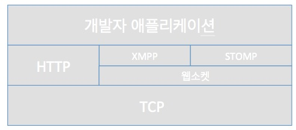

#  웹소켓 (Websocket) 
## 1.  웹소켓 프로토콜

### 1.1 웹소켓 열기 핸드셰이크
### 1.2 키 응답 처리
웹소켓 프로토콜은 RFC 6455  문서에 정의돼어 있으며 Sec- 로 시작하는 헤더들을 이용한다.

| 헤더 | 설명 |
|--------|--------|
|Sec-WebSocket-Key|        |
|Sec-WebSocket-Accept|        |
|Sec-WebSocket-Extensions|        |
|Sec-WebSocket-Key|        |
|Sec-WebSocket-Key||

### 1.3 메세지 포멧

## 2. XMPP/웹소켓

### 2.1 XMPP란

XMPP는 확장가능 메시지 전달 및 접속 여부 업데이트 프로토콜(eXtensible Messaging and Presence Protocol)을 
의미한다.

RFC3920, RFC3921 등 IETF(Internet Engineering Task Force)에서 제정한 국제 표준 프로토콜로 인스턴트메신저(Instant Messenger)를 위한 프로토콜로 잘 알려져 있다. 국내에서는 몇년 전 구글(google.com)이 XMPP를 채택, googletalk 이라는 인스턴트메신저 서비스를 시작하면서 널리 알려지는 계기가 되었다. XMPP 규격은 2004년 봄에 표준으로 제정되었지만, 사실은 Jabber라는 이름으로 1998년부터 연구가 시작되었고 이 연구의 결과가 표준화라는 결과를 맞이 하게됨

### 2.2 규격

이 표준은 인터넷상의 두 지점간의 통신 규격에 관한 것이다. 두 지점은 이메일주소와 같은 방식으로 표현되며 이들 지점간 확장가능한 메시지(message) 그리고 프레즌스(presence)를 거의 실시간(near-realtime)으로 전달해주는 규격이다. 이 규격에 의하면 인터넷상의 지점은 DNS(Domain Name Service) 서비스에 의해 명명될 수 있는 위치들간의 통신으로 예를 들어 yourhost.com 이라는 주소도 하나의 지점이며 yourid@yourhost.com 또한 하나의 주소이다. 결국 DNS에 의해 표현될 수 있는 주소 공간은 새로이 등록되는 도메인 이름에 의해서 계속해서 증가하므로 이론상 무한대의 사용자가 서로 통신이 가능하게 되는 규격인 셈이다

### 2.3 표준IM을 위한 XMPP

알려진 대로 XMPP 프로토콜은 표준 인스턴트메신저 서비스를 위한 훌륭한 프레임워크를 제공되었으며, 이미 전세계 수 많은 사람들이 XMPP 사용자가 되어 있으며 지금도 계속해서 증가하고 있다. 이것은 XMPP 소프트웨어를 만드는 회사와 단체가 증가하는 것을 보면 알 수 있다. 그러나 인스탄트 메신저 서비스만 가능한 것은 아니다. XMPP라는 규격이 Message와 동시에 Presence라는 것을 정의하고 있기 때문에 그 사용처는 매우 다양하다.

### 2.4 강력한 Presence 기반 응용이 가능
프레즌스(Presence)는 XMPP의 가장 중요한 요소중의 하나이다. DNS에 의해 확장되는 거대한 XMPP 공간에서 각 지점의 상태들을 프레즌스라고 하고 각 지점의 상태가 변경될 경우 이 상태 변경은 즉각 이에 관심있어 하는 지점으로 브로드캐스팅된다. 다른 지점의 상태변경에 관심있는 지점이 되기 위해서는 프레즌스를 구독(subscribe)하는 과정이 필요하다

### 2.5 웹응용계층의 프로토콜 계층 쌓기

